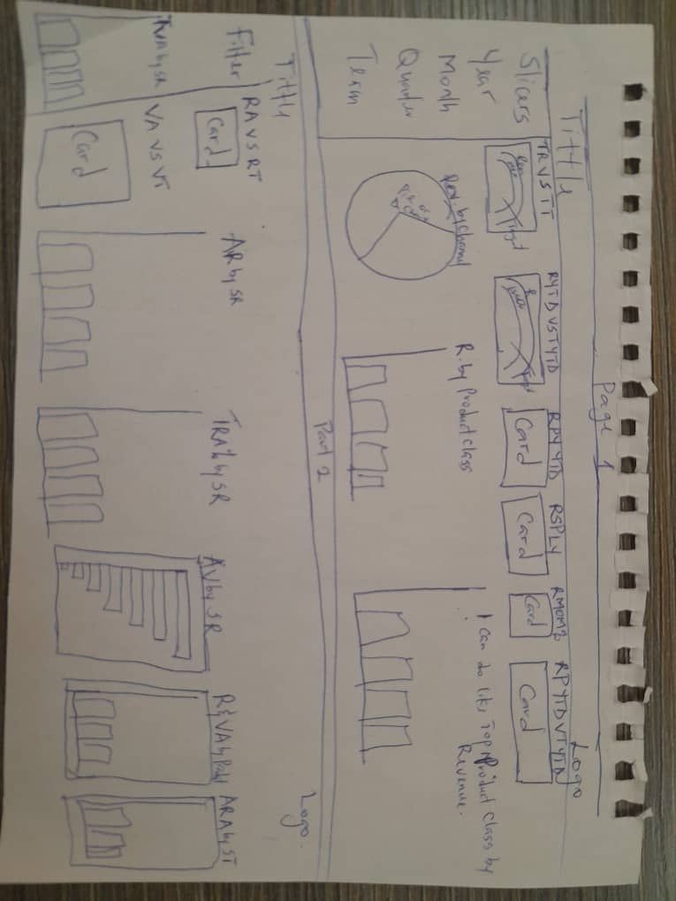
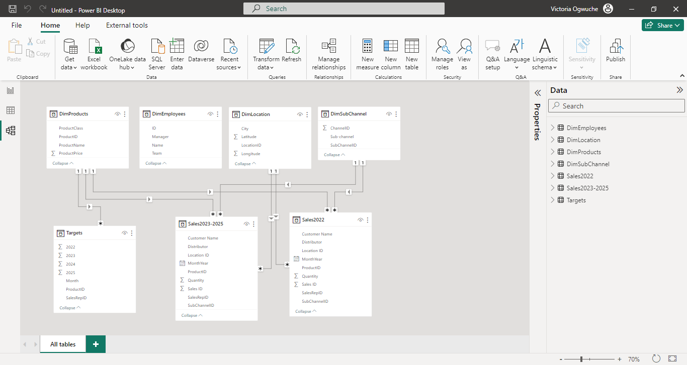
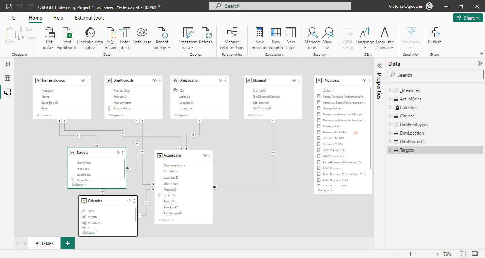
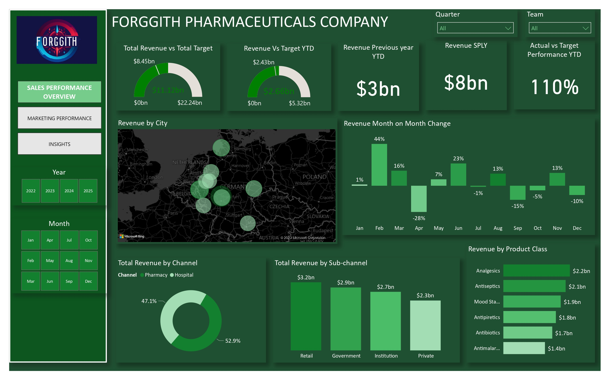
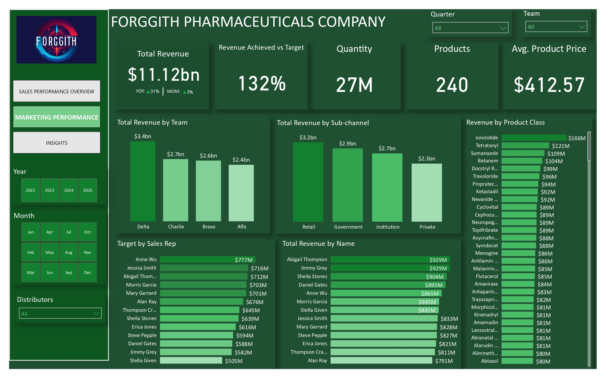

# Forggith Sales Analysis

## Introduction

This power Bi project aims to provide insights into the Sales and Marketing performance of Forggith Pharmaceutical company over the years. By analzing various aspects of the data, we seek to identify sales trends, marketing objectives through tracking and monitoring of KPIS, make data driven recommendations, and gain a deeper understanding of the company performance.

## Data Sources
The Primary dataset used for this project is the Actualsales data and the Target data, containing detailed information about the sales made and the set target of the company

## Problem statement/ Requirement.

Forggith is looking to create some Power BI Reports to assist in guiding their strategies, tactics and operations as a company. For a start, a couple of numbers have been identified to be reported in their data as reports.

Two pages/chapters of reports
1. Sales Performance overview
  - Total Revenue
  - Total Revenue Year To Date (YTD)/ Previous Year YTD
  - Total Revenue Same Period Last Year(SPLY)
  - Total Target/Target YTD
  - Actual Revenue Performance YTD vs Target YTD
  - Revenue by Channel
  - Revenue by Product Class

2. Marketing Performance. 
  -  Revenue Achieved vs Revenue Target
  -  Volume Achieved vs Volume Target
  -  Actual Revenue by Sales Representative
  -  Target Revenue Achievement% by Sales Representative.
  -  Actual Volume by Sales Representative
  -  Target Volume Achievement by Sales Representative
  -  Actual Revenue Achievement by Sales Team
  -  Revenue and Volume Achievement by Product.

Skills/ Concepts demonstrated:
-  Dax
-  Quick measures
-  Page navigation
-  Modelling
-  Button
-  Dax Studio
-  Mockup 

## Data Cleaning and Transformation 
Two dataset was provided for this project which are the **_ActualSales data_** and **_Target data_**. The following data cleaning was done on the dataset as this will help in getting accurate results for our visualisation. 

-  Append Queries: Append queries was done for the Actualsales 2022 and the Actual sales 2023 - 2025
-  ETL file was created for tables that will not be loaded into the power Bi.
-  Target dataset
  .  Unpivote the year columns
  .  The the value column to Target Qty in the Formula bar
  .  Merge the month/Year column
-  Data type was changed
-  Making first row as header was done on all of the dataset table
-  Because there is no relationship btween the channel table and the sales table, the channel table was merged withe the subchannel column as this will help with a better relation model.

## Modelling:
The best type of model in power Bi is the star schema, an automatically derived dimension table was adjusted to remove and replace unwanted relationship.

Auto model             |       Adjusted-model
:---------------------:|:---------------------:
   |   

The model is a star schema.
There are 5 dimenstion tables and 2 fact tables. The dimension tables are all joined to the fact tables with one-to-many- relationship.

## Visualization:

The report comprises of 3 pages:
1.  Sales Overview
2.  Marketing Performance
3.  Insights and Recommendations

You can interact with the reprt 

## Analysis:

Here, we could discover the following insights.

## Sales Overview: 

.  The Total Revenue was $11.12bn
.  The total Target was $8.45bn
.  The Revenue YTD was $2.66bn against the Target YTD of $2.43.
.  Pharmacy Channel generated a total of 52.9% revenue  higher than Hospital 47.1% revenue.

## Marketing Performance: 

.  There are 240 products.
.  Each product price cost $412.57 on average.

## Recommendation
It's positive that the total revenue from 2022-2025 exceeded the target revenue, indicating overall success.
Identify underperforming products and develop strategies for improvement.
Assess why the Pharmacy Channel outperformed the Hospital Channel. Identify strategies from the Pharmacy Channel that can be implemented in the Hospital Channel to boost revenue.

• Here are ideas of how these reports will be used:
The Sales Representative can track their performances through-out the periods to plan their marketing activities.
The Team Managers can track their teams' performances through-out the periods to plan their teams' activities.
Executive team can track Revenue numbers to monitor alignment with the set targets to influence medium to long term strategies.
Note: You are to use the company's standard colors across your reports. You will find the Logo and Color guides in the Assets Folder you can download in the next lesson.

